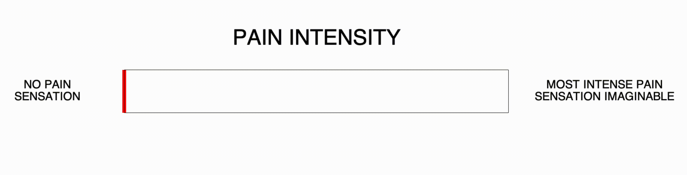

## vas
> visual analog scale controlled by keyboard or MRI-compatible botton box

**to run**:
- `$ python vas.py [--screen <num>]`
-  `--screen <num>` local (0) or projector (1)
- responds to keys mapped to [ 1 ] and [ 2 ]
- note: button box should not send release code until key is released

**requirements**:
- [psychopy](https://www.psychopy.org/download.html#conda)
- psychtoolbox==3.0.16
